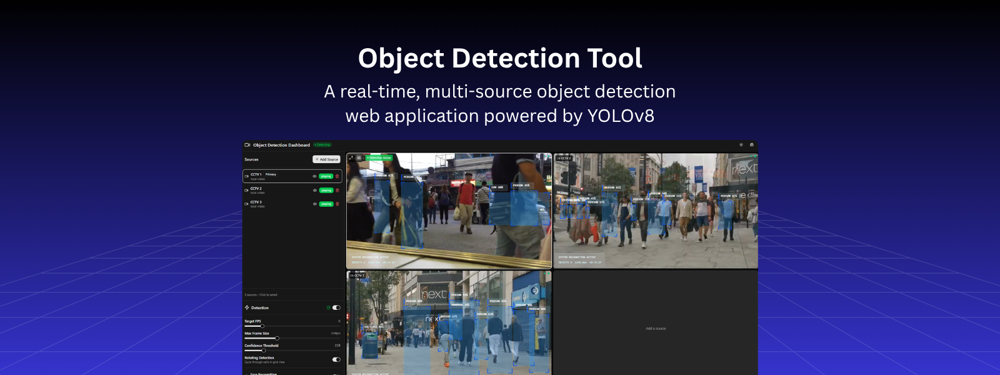
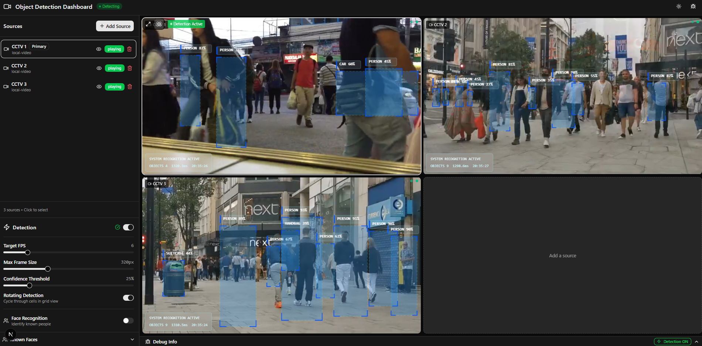
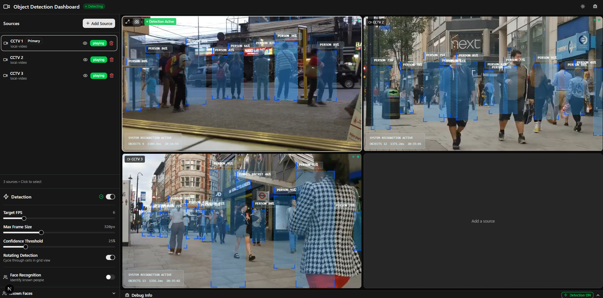

# Object Detection Tool



A real-time, multi-source object detection web application powered by **YOLOv8** (via ONNX Runtime Web) running entirely in the browser. Supports multiple live and recorded video sources simultaneously with a detection overlay, face recognition, and an interactive dashboard UI.

   

---

## Features

- **Client-side YOLOv8 inference** — ONNX Runtime Web runs the YOLOv8n model directly in the browser; no server-side GPU required
- **Multiple source types** — Webcam, direct MP4 URL, HLS/M3U8 streams, local video files, and local image files
- **Multi-camera grid view** — Monitor up to 16 sources simultaneously with rotating detection
- **Single view mode** — Full-focus detection on a primary source at higher FPS
- **Face recognition** — Enroll faces and identify known individuals in person detections (face-api.js)
- **Per-source detection toggle** — Enable/disable detection independently per source
- **Detection overlay** — Bounding boxes with class labels and confidence scores rendered on a canvas overlay
- **Demo mode** — Runs with random simulated detections if the ONNX model is not available
- **Dark/light theme** — Toggleable with persistence
- **Resizable sidebar** — Drag to resize the source management panel
- **Debug panel** — Real-time FPS, inference time, and active source counters

---

## Tech Stack

| Layer | Technology |
|---|---|
| Framework | [Next.js 16](https://nextjs.org/) (App Router) |
| UI Library | [React 19](https://react.dev/) |
| Language | TypeScript 5 |
| Styling | [Tailwind CSS v4](https://tailwindcss.com/) |
| Component Library | [shadcn/ui](https://ui.shadcn.com/) + [Radix UI](https://www.radix-ui.com/) |
| State Management | [Zustand 5](https://zustand-demo.pmnd.rs/) |
| Detection Model | [YOLOv8n](https://github.com/ultralytics/ultralytics) (ONNX format) via [ONNX Runtime Web](https://onnxruntime.ai/) |
| HLS Streaming | [HLS.js](https://github.com/video-dev/hls.js/) |
| Face Recognition | [face-api.js](https://github.com/justadudewhohacks/face-api.js) |
| Database (ORM) | [Prisma](https://www.prisma.io/) |
| Animations | [Framer Motion](https://www.framer.com/motion/) |

---

## Screenshots

### Multi-Camera Grid View





---

## Requirements

- **Node.js** 18+ (or [Bun](https://bun.sh/) 1.0+)
- A modern browser with WebGL support (Chrome 90+, Firefox 90+, Safari 15+, Edge 90+)
- The YOLOv8n ONNX model (see [Model Setup](#model-setup))

---

## Installation

```bash
# Clone the repository
git clone https://github.com/aymanaljunaid/object-detection-tool.git
cd object-detection-tool

# Install dependencies
npm install
# or with bun
bun install
```

---

## Model Setup

The app uses a YOLOv8n ONNX model for detection. Download or export the model and place it in the `public/models/` directory:

```
public/
  models/
    yolov8n.onnx        ← required
```

**Option 1 – Download pre-exported model:**
```bash
# Using Python + Ultralytics
pip install ultralytics
yolo export model=yolov8n.pt format=onnx opset=12 simplify=true
# Copy the resulting yolov8n.onnx to public/models/
```

**Option 2 – Demo mode:**  
If no model is found, the app automatically runs in **Demo Mode** with simulated random detections, so you can still explore the UI.

---

## Environment Variables

Create a `.env.local` file in the project root. All variables are optional for basic usage:

```env
# Database (Prisma) — optional, for persistent face identity storage
DATABASE_URL="file:./db/app.db"
```

---

## Running Locally

```bash
# Development server (hot reload)
npm run dev

# Open in browser
# http://localhost:3000
```

---

## Build for Production

```bash
# Build standalone bundle
npm run build

# Start production server
npm run start
```

The build script copies static assets and public files into `.next/standalone/` for deployment.

---

## Database Setup

The app uses SQLite via Prisma (for face identity storage). Run migrations before first use:

```bash
# Push schema to database
npm run db:push

# Or run full migrations
npm run db:migrate
```

---

## Usage Guide

### Adding a Source

1. Click **"Add Source"** in the sidebar.
2. Select the source type:
   - **Webcam** — Uses your device's camera via `getUserMedia`
   - **Video URL** — A direct HTTP link to an MP4 file
   - **HLS Stream** — An M3U8 live or VOD stream URL
   - **Local Video** — Upload a video file from your device
   - **Local Image** — Upload an image file for static detection
3. Enter a name and the URL (or select a file).
4. Click **"Add Source"** to confirm.

### Detection

- Enable **"Detection"** in the Detection Control Panel to start inference.
- Toggle detection per-source using the 👁 icon next to each source in the list.
- Switch between **Single** and **Grid** view modes using the view controls.

### Face Recognition

1. Open the **Face Memory** panel.
2. Enroll a face by capturing a frame and assigning a name.
3. Once enrolled, the app will attempt to match detected persons to known faces.

### View Modes

- **Single mode** — Displays the primary (selected) source fullscreen with full detection FPS.
- **Grid mode** — Displays all sources in a responsive grid; detection rotates across sources.

---

## Supported Source Types

| Type | Description | Detection Support |
|---|---|---|
| `webcam` | Local camera via `getUserMedia` | ✅ Full |
| `mp4-url` | Direct MP4 HTTP URL | ✅ Full |
| `hls-url` | HLS/M3U8 stream (live or VOD) | ✅ Full |
| `local-video` | Uploaded video file | ✅ Full |
| `local-image` | Uploaded image file | ✅ Full |

---

## Project Structure

```
src/
├── app/
│   ├── api/           # API routes (root ping)
│   ├── layout.tsx     # Root layout with providers
│   ├── page.tsx       # Main application page
│   └── globals.css    # Global styles
│
├── components/
│   ├── camera/        # CamCell, MultiCameraGrid
│   ├── detection/     # DetectionOverlay, DetectionStats
│   ├── panels/        # SourceManagerPanel, DetectionControlPanel,
│   │                  #   FaceMemoryPanel, DebugPanel
│   └── ui/            # shadcn/ui components
│
├── hooks/
│   ├── usePlayback.ts             # Video source lifecycle
│   ├── useDetectionScheduler.ts   # Detection loop & scheduling
│   ├── useFrameCapture.ts         # Frame extraction for inference
│   └── useFaceRecognition.ts      # Face recognition integration
│
├── lib/
│   ├── adapters/      # Source adapters (Webcam, HLS, Video, Image)
│   ├── constants.ts   # App-wide config constants
│   ├── db.ts          # Prisma client
│   ├── faceStorage.ts # Face embedding storage (IndexedDB)
│   └── utils/         # Logger, coordinate utilities, generation tokens
│
├── services/
│   ├── detector.ts        # ONNX YOLOv8 detector service
│   └── faceRecognizer.ts  # face-api.js recognition service
│
├── store/
│   └── appStore.ts    # Zustand global state store
│
└── types/
    ├── index.ts       # All core TypeScript types
    └── face.ts        # Face recognition types
```

---

## Scripts

| Script | Description |
|---|---|
| `npm run dev` | Start development server on port 3000 |
| `npm run build` | Build production bundle |
| `npm run start` | Start production server |
| `npm run lint` | Run ESLint |
| `npm run db:push` | Push Prisma schema to database |
| `npm run db:generate` | Regenerate Prisma client |
| `npm run db:migrate` | Run database migrations |
| `npm run db:reset` | Reset database |

---

## Troubleshooting

**App loads but detection shows "Demo Mode"**  
→ The ONNX model file is missing. Place `yolov8n.onnx` in `public/models/`. See [Model Setup](#model-setup).

**Webcam not working**  
→ The browser requires HTTPS (or `localhost`) to access the camera. Ensure you're on `http://localhost:3000` or a domain with a valid SSL certificate.

**HLS stream not playing**  
→ Check that the M3U8 URL is publicly accessible and that CORS headers are set on the stream server. Some streams require the correct `Referer` header.

**Local video file is not detected**  
→ Ensure the video file is in a browser-supported format (MP4 H.264, WebM VP8/VP9). Very large files may take a moment to load.

**Face recognition is slow**  
→ face-api.js runs in the browser. Performance depends on device speed. Reduce the number of enrolled faces or lower the detection interval.

**Build fails with Prisma errors**  
→ Run `npm run db:generate` to regenerate the Prisma client before building.

---

## Deployment

The project is configured for standalone Next.js deployment. After `npm run build`:

```bash
# The standalone server is at
node .next/standalone/server.js
```

For Docker or Caddy deployment, see `Caddyfile.txt` in the project root for a sample reverse proxy configuration.

---

## Contributing

1. Fork the repository
2. Create a feature branch: `git checkout -b feature/my-feature`
3. Commit your changes: `git commit -m 'feat: add my feature'`
4. Push to the branch: `git push origin feature/my-feature`
5. Open a Pull Request

Please follow the existing code style and run `npm run lint` before submitting.

---

## License

This project is licensed under the MIT License - see the [LICENSE](LICENSE) file for details.

---

## Acknowledgements

- [Ultralytics YOLOv8](https://github.com/ultralytics/ultralytics) — detection model architecture
- [ONNX Runtime Web](https://onnxruntime.ai/) — browser-side inference engine
- [face-api.js](https://github.com/justadudewhohacks/face-api.js) — face detection and recognition
- [HLS.js](https://github.com/video-dev/hls.js/) — HLS stream playback
- [shadcn/ui](https://ui.shadcn.com/) — UI component library
- [Zustand](https://github.com/pmndrs/zustand) — state management
